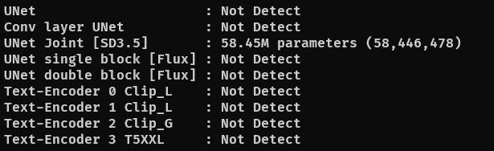

# LoRA-Parameter + inspector


Requirements
```
pip install -r requirements.txt
```

## Usage
```
python LoRA_parameter.py --input safetensors_lora_file
```
or
```
drop file into dropfile_LoRA_parameter.bat
```

## Extra Args

- (required) `--input` or `-i` to open a LoRA safetensors file.
- (optional) `--metadata` to extract metadata from lora file (only essentials)
- (optional) `--debug` to debug which part should calculate support (`unet` and `te`) 
  - `--debug unet` for showing unet only
  - `--debug te` for debugging te only
  - `--debug unet te` for debugging both (this args is like no `--debug` args)
- (optional) `--save_metadata` for saving metadata


## Support Model
- Stable Diffusion 1.5 [Conv]
- Stable Diffusion XL [Conv]
- Stable Diffusion 3.0/3.5 (Support show metadata only)
- Flux.1 Dev

## TODO

- [ ] Graph Plotting (export as image)

## Sample output

### average, max, parameters in each block weight

```
UNet block averages, max weights and parameters:
+---------------------------+--------------------+--------------------+--------------+
|        block name         |   average weight   |     max weight     |  parameters  |
|---------------------------+--------------------+--------------------+--------------|
| lora_unet_input_blocks_0  |         -          |         -          |      -       |
| lora_unet_input_blocks_1  |         -          |         -          |      -       |
| lora_unet_input_blocks_2  |         -          |         -          |      -       |
| lora_unet_input_blocks_3  |         -          |         -          |      -       |
| lora_unet_input_blocks_4  | 0.0106893545016646 | 0.0395507812500000 |   745,494    |
| lora_unet_input_blocks_5  | 0.0107037285342813 | 0.0395507812500000 |   745,494    |
| lora_unet_input_blocks_6  |         -          |         -          |      -       |
...
| lora_unet_output_blocks_5 | 0.0113188372924924 | 0.0395507812500000 |   745,494    |
| lora_unet_output_blocks_6 |         -          |         -          |      -       |
| lora_unet_output_blocks_7 |         -          |         -          |      -       |
| lora_unet_output_blocks_8 |         -          |         -          |      -       |
+---------------------------+--------------------+--------------------+--------------+
UNet average weight : 0.010021560063416307

Text-Encoder TE1 block averages, max weights and parameters:
+---------------------------------------+--------------------+--------------------+--------------+
|              block name               |   average weight   |     max weight     |  parameters  |
|---------------------------------------+--------------------+--------------------+--------------|
| lora_te1_text_model_encoder_layers_0  | 0.0085962032899261 | 0.0361328125000000 |   221,190    |
| lora_te1_text_model_encoder_layers_1  | 0.0081164939329028 | 0.0361328125000000 |   663,570    |
| lora_te1_text_model_encoder_layers_2  | 0.0086141275241971 | 0.0361328125000000 |   221,190    |
...
| lora_te1_text_model_encoder_layers_10 | 0.0086958650499582 | 0.0361328125000000 |   221,190    |
| lora_te1_text_model_encoder_layers_11 | 0.0070287575945258 | 0.0361328125000000 |   221,190    |
+---------------------------------------+--------------------+--------------------+--------------+
Text-Encoder TE1 average weight : 0.008498185547068715
```

### metadata

```
Metadata
+-----------------------------------+--------------------------------------------------+
| key                               | value                                            |
|-----------------------------------+--------------------------------------------------|
| ss_steps                          | 1575                                             |
| ss_huber_scale                    | 1                                                |
| ss_training_comment               | None                                             |
| ss_random_crop                    | False                                            |
| ss_ip_noise_gamma                 | None                                             |
| ss_base_model_version             | sdxl_base_v1-0                                   |
...
| ss_keep_tokens                    | 1                                                |
| ss_network_dim                    | 16                                               |
| ss_huber_c                        | 0.85                                             |
+-----------------------------------+--------------------------------------------------+
```